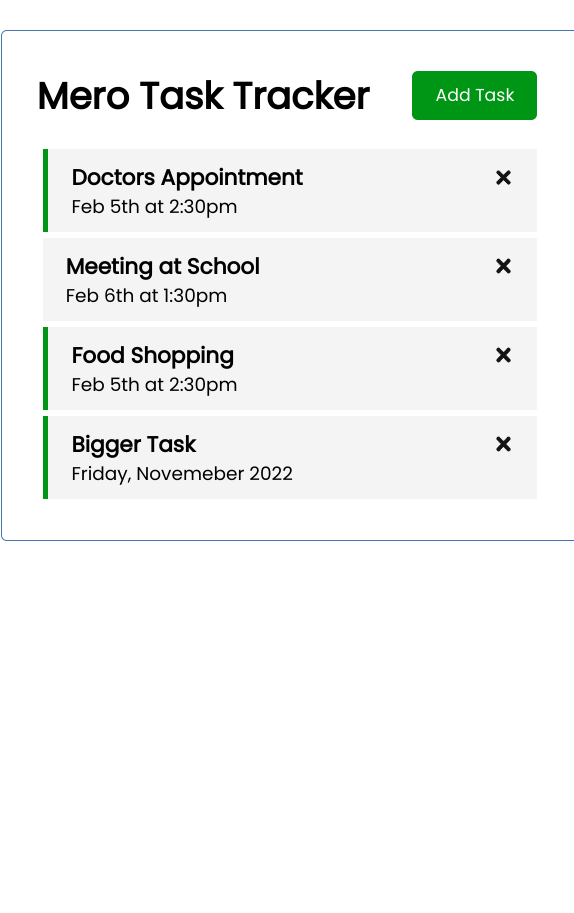
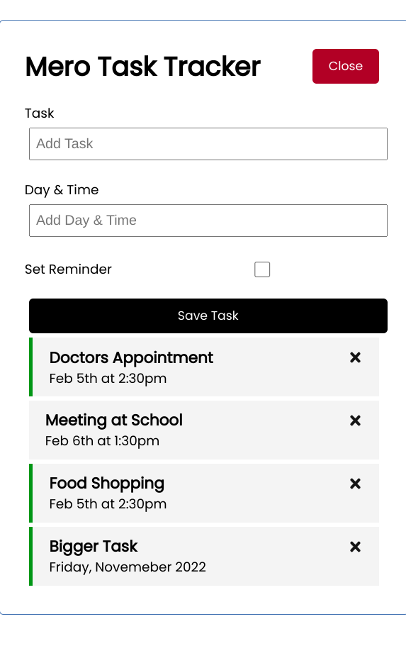

# Mero Task Tracker

Mero Task Tracker is a simple SPA (Single Page Application) for tracking tasks. It is built using React. It uses a REST API to store and retrieve tasks which is based on `json-server` which is a simple REST API server, just like `sqlite3` but using JSON file.

## Libraries

- [React](https://reactjs.org/)
- [React Router](https://reactrouter.com/)
- [JSON Server](https://github.com/typicode/json-server)

## Installation

1. Clone the repository
2. Run `npm install` to install the dependencies
3. Run `npm start server` to start the development server (json-server)
4. Run `npm start` to start the react application
4. Open `http://localhost:3000` in your browser

NOTE: The server runs at port `8000` by default. You can change the port by editing the `server` script in `package.json` file and change the port in `App.js` file.

## Screenshots

Guided by Brad Traversy [in this video](https://www.youtube.com/watch?v=w7ejDZ8SWv8)

MADE WITH ❤️ IN NEPAL
